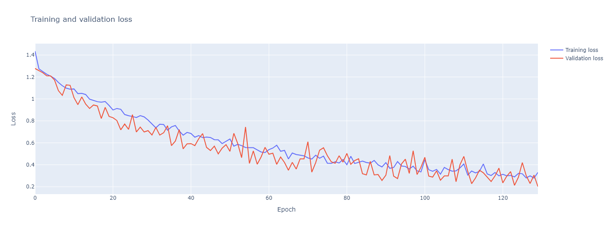

<!--  -->
[](https://www.python.org)
[](https://jupyterlab.readthedocs.io/en/stable)


# `SKINALYZE: Personalized skin care recommendations`


> Team: `C241-PS385`
> 
> Project for: `Capstone Project Bangkit Academy 2024 H1`  


## Objective

- 📱 **Develop a mobile application (Android)** for personalized skincare recommendations.
  
- 🧠 **Implement a machine-learning model** for Skin Problem Classification. This model will analyze user-uploaded facial photos and identify specific skin concerns (e.g., dark spots, acne, pores).
  
- 💡 **Design a recommendation system** that goes beyond skin type identification. This system will offer personalized skincare product packages tailored to individual skin concerns.
  
- 😌 **Simplify the skincare product selection process** for users. This will be achieved by providing a user-centric application with clear and actionable recommendations.
  
- 📚 **Promote informed decision-making** regarding skincare products. This will be done by leveraging machine learning and personalized analysis.
  
- ♻️ **Reduce product waste** in the skincare industry. This will be achieved by recommending effective product packages that directly address users' specific needs.

## Directory in this repository

```plaintext
.Skinalyze-ML/
├── README.md
├── data
│   └── dataset.txt
├── model
│   └── model.txt
├── notebooks
│   ├── skin_problem_classifier.ipynb
│   └── training
│       ├── skin_problem_classification_training_v1.ipynb
│       └── skin_problem_classification_training_v2.ipynb
├── results
│   ├── confusion_matrix
│   │   └── confusion_matrix.png
│   ├── evaluation_results
│   │   └── evaluation_results.csv
│   ├── model_architecture
│   │   └── model.png
│   ├── model_summary
│   │   └── model_summary.txt
│   ├── training_logs
│   │   └── training_log.csv
│   └── training_validation_plots
│       ├── training_validation_accuracy.png
│       └── training_validation_loss.png
└── src
    └── assets
        ├── gif
        │   ├── great_work.gif
        │   └── thankyou.gif
        └── image
            ├── banner_readme.png
            └── tensorflow_logo.png
```

## Modelling results

The results of the model training and evaluation are organized in the `results` directory. Here's a brief description of what each subdirectory contains:

- `model_summary`: Contains a text file (`model_summary.txt`) with the summary of the trained model.
- `model_architecture`: Contains an image file (`model.png`) that visualizes the architecture of the trained model.
- `training_logs`: Contains a CSV file (`training_log.csv`) with the logs of the model training process.
- `evaluation_results`: Contains a CSV file (`evaluation_results.csv`) with the results of the model evaluation.
- `confusion_matrix`: Contains an image file (`confusion_matrix.png`) that visualizes the confusion matrix of the model predictions.
- `training_validation_plots`: Contains two image files (`train_val_accuracy.png` and `train_val_loss.png`) that plot the training and validation accuracy and loss, respectively, over each epoch.

1. Model Summary
The `model_summary.txt` file contains a summary of the trained model, including the layers, parameters, and output shape. Below is the content of the `model_summary.txt` file:

    ```plaintext
    Model: "SkinProblem_Classifier"
    _________________________________________________________________
    Layer (type)                Output Shape              Param #   
    =================================================================
    input_layer (InputLayer)    [(None, 224, 224, 3)]     0         
                                                                    
    conv1 (Conv2D)              (None, 222, 222, 16)      448       
                                                                    
    max_pool1 (MaxPooling2D)    (None, 111, 111, 16)      0         
                                                                    
    conv2 (Conv2D)              (None, 109, 109, 32)      4640      
                                                                    
    max_pool2 (MaxPooling2D)    (None, 54, 54, 32)        0         
                                                                    
    conv3 (Conv2D)              (None, 52, 52, 64)        18496     
                                                                    
    max_pool3 (MaxPooling2D)    (None, 26, 26, 64)        0         
                                                                    
    flatten (Flatten)           (None, 43264)             0         
                                                                    
    dense1 (Dense)              (None, 512)               22151680  
                                                                    
    dropout (Dropout)           (None, 512)               0         
                                                                    
    dense2 (Dense)              (None, 128)               65664     
                                                                    
    dense3 (Dense)              (None, 64)                8256      
                                                                    
    dense4 (Dense)              (None, 16)                1040      
                                                                    
    output_layer (Dense)        (None, 5)                 85        
                                                                    
    =================================================================
    Total params: 22250309 (84.88 MB)
    Trainable params: 22250309 (84.88 MB)
    Non-trainable params: 0 (0.00 Byte)
    _________________________________________________________________

    ```

2. Model Architecture
The `model.png` file visualizes the architecture of the trained model. It shows the layers and connections between them, providing a clear overview of the model's structure. Below is the image of the model architecture:

    <br><br>
    
    <br><br>

3. Training Logs
The `training_log.csv` file contains the logs of the model training process, including the training and validation loss and accuracy for each epoch. Below is a sample of the training logs:

    ```plaintext
    epoch,accuracy,loss,val_accuracy,val_loss
    0,0.3529999852180481,1.3982481956481934,0.4390000104904175,1.2333430051803589
    1,0.42500001192092896,1.24297297000885,0.4334999918937683,1.1779710054397583
    2,0.44200000166893005,1.1989573240280151,0.5230000019073486,1.058279275894165
    3,0.47450000047683716,1.1513628959655762,0.512499988079071,1.0816335678100586
    4,0.4894999861717224,1.1482555866241455,0.5220000147819519,1.1089433431625366
    5,0.5005000233650208,1.1328016519546509,0.47699999809265137,1.1915416717529297
    6,0.5264999866485596,1.073413372039795,0.5640000104904175,1.028179407119751
    7,0.5410000085830688,1.0344130992889404,0.5830000042915344,0.9520224928855896
    8,0.5740000009536743,0.994756281375885,0.5109999775886536,1.1308021545410156
    9,0.6050000190734863,0.9518226981163025,0.6205000281333923,0.8958635926246643
    10,0.5799999833106995,0.9876976609230042,0.5270000100135803,1.1309165954589844
    ```

4. Evaluation Results
The `evaluation_results.csv` file contains the results of the model evaluation from the validation dataset, including the accuracy and loss. Below is the result of the evaluation results:

    ```plaintext
    Loss,Accuracy
    0.4638826251029968,0.8379999995231628
    ```

5. Confusion Matrix
The `confusion_matrix.png` file visualizes the confusion matrix of the model predictions. It shows the true positive, true negative, false positive, and false negative values for each class, providing insights into the model's performance. Below is the image of the confusion matrix:

    

6. Training and Validation Plots
The `training_validation_accuracy.png` and `training_validation_loss.png` files plot the training and validation accuracy and loss, respectively, over each epoch. These plots provide a visual representation of the model's performance during training. Below are the images of the training and validation plots:

    <br><br>
    
    <br><br>

    <br><br>
    
    <br><br>


## Model Documentation

<p align="center">
    
</p>

### Model Name

The model's name is `skin_problem_classifier.tflite`. This model is a multiclass classifier model designed to analyze user skin problems and normal skin.

### Model Description

The model is a multiclass classifier that predicts the skin problem based on the input image from the user. It classifies the images into one of the following 5 classes:

1. Acnes
2. Blackheads
3. Darkspots
4. Normal
5. Wrinkles

### Model Input

The model expects the following input:

- The shape of the input tensor should be `(1, 224, 224, 3)`, which corresponds to a color image of size 224x224.
- The data type of the input should be `float32`.
- The input images should be normalized (pixel values ranging from 0 to 1) and resized to 224x224.

#### Input Requirements

The model expects a single color image as input. Here are the specific requirements:

- **Shape**: The input image should be resized to 224x224 pixels, resulting in a tensor of shape `(1, 224, 224, 3)`.
- **Data Type**: The pixel values of the image should be of type `float32`.
- **Normalization**: The pixel values should be normalized to range from 0 to 1.

#### Input Details

Here's a more detailed view of the input tensor:

- **Name**: `serving_default_input_1:0`
- **Shape**: `(1, 224, 224, 3)`
- **Data Type**: `float32`

#### Full Input Details

For those interested in more technical details, here's the full description of the input tensor:

```json
{
  "name": "serving_default_input_1:0",
  "index": 0,
  "shape": [1, 224, 224, 3],
  "shape_signature": [-1, 224, 224, 3],
  "dtype": "float32",
  "quantization": (0.0, 0),
  "quantization_parameters": {
    "scales": [],
    "zero_points": [],
    "quantized_dimension": 0
  },
  "sparsity_parameters": {}
}
```

<p align="center">
    
</p>
<br><br>

- **Name (`name`)**: This is the identifier for the input tensor. In this case, it's `serving_default_input_1:0`.

- **Index (`index`)**: This is the index of the input tensor in the model's list of tensors. In this case, it's `0`.

- **Shape (`shape`)**: This describes the dimensions of the input tensor. In this case, it's `[1, 224, 224, 3]`, which means the model expects a single image of size 224x224 with 3 color channels (RGB).

- **Shape Signature (`shape_signature`)**: This is similar to `shape`, but it can also handle variable-sized dimensions. The `-1` means that dimensions can be of any size. In this case, it's `[-1, 224, 224, 3]`, which means the model can handle a batch of images of size 224x224 with 3 color channels.

- **Data Type (`dtype`)**: This is the type of data the tensor holds. In this case, it's `float32`, which means the pixel values of the image should be floating-point numbers.

- **Quantization (`quantization`)**: This describes the scale and zero point used for quantization of the tensor. In this case, it's `(0.0, 0)`, which means no quantization is applied.

- **Quantization Parameters (`quantization_parameters`)**: This provides more details about the quantization parameters. In this case, all fields are empty, which means no quantization is applied.

- **Sparsity Parameters (`sparsity_parameters`)**: This provides details about the sparsity parameters of the tensor. In this case, it's empty, which means no sparsity is applied.

### Model Output

The model produces the following output:

- The shape of the output tensor is `(1, 5)`, which corresponds to the probabilities of the 5 classes.
- The data type of the output is `float32`.
- The output should be post-processed by finding the index with the maximum probability. This index corresponds to the predicted class.

#### Output Requirements

The model produces a single output tensor. Here are the specific requirements:

- **Shape**: The output tensor has a shape of `(1, 5)`, which corresponds to the probabilities of the 5 classes.
- **Data Type**: The data type of the output is `float32`.

#### Output Details

Here's a more detailed view of the output tensor:

- **Name**: `StatefulPartitionedCall:0`
- **Shape**: `(1, 5)`
- **Data Type**: `float32`

#### Full Output Details

For those interested in more technical details, here's the full description of the output tensor:

```json
{
  "name": "StatefulPartitionedCall:0",
  "index": 49,
  "shape": [1, 5],
  "shape_signature": [-1, 5],
  "dtype": "float32",
  "quantization": (0.0, 0),
  "quantization_parameters": {
    "scales": [],
    "zero_points": [],
    "quantized_dimension": 0
  },
  "sparsity_parameters": {}
}
```
<p align="center">
    
</p>
<br><br>

- **Name (`name`)**: This is the identifier for the output tensor. In this case, it's `StatefulPartitionedCall:0`.

- **Index (`index`)**: This is the index of the output tensor in the model's list of tensors. In this case, it's `49`.

- **Shape (`shape`)**: This describes the dimensions of the output tensor. In this case, it's `[1, 5]`, which means the model produces probabilities for 5 classes.

- **Shape Signature (`shape_signature`)**: This is similar to `shape`, but it can also handle variable-sized dimensions. The `-1` means that dimensions can be of any size. In this case, it's `[-1, 5]`, which means the model can handle a batch of outputs for 5 classes.

- **Data Type (`dtype`)**: This is the type of data the tensor holds. In this case, it's `float32`, which means the output probabilities are floating-point numbers.

- **Quantization (`quantization`)**: This describes the scale and zero point used for quantization of the tensor. In this case, it's `(0.0, 0)`, which means no quantization is applied.

- **Quantization Parameters (`quantization_parameters`)**: This provides more details about the quantization parameters. In this case, all fields are empty, which means no quantization is applied.

- **Sparsity Parameters (`sparsity_parameters`)**: This provides details about the sparsity parameters of the tensor. In this case, it's empty, which means no sparsity is applied.

### Output Comparison

Here's an example of how to compare the output of the TensorFlow Lite model with the original model:

```python
# Assuming train_images is of shape [32, 224, 224, 3]
for i in range(train_images.shape[0]):
    # Get one image
    input_data = train_images[i:i+1]

    # Ensure the input data is a numpy array of type float32
    input_data = np.array(input_data, dtype=np.float32)

    # Set the input tensor
    interpreter.set_tensor(input_details[0]['index'], input_data)

    # Invoke the interpreter
    interpreter.invoke()

    # Get the output tensor
    tflite_output = interpreter.get_tensor(output_details[0]['index'])

    # Predict the output using the original model
    original_output = model.predict(input_data)

    # Print the outputs
    print(f"TFLite output: {tflite_output}")
    print(f"Original model output: {original_output}")
```

This code snippet runs the same input through both the TensorFlow Lite model and the original model and prints the outputs. This allows us to compare the results and verify that the TensorFlow Lite model is behaving as expected.

Here are some of the results of comparing the output of the TensorFlow Lite model with the original model:

```plaintext
1/1 [==============================] - 0s 374ms/step
TFLite output: [[0.0559 0.2786 0.4832 0.1698 0.0125]]
Original model output: [[0.0234 0.7468 0.0933 0.1334 0.0032]]
...
...
1/1 [==============================] - 0s 67ms/step
TFLite output: [[1.0758e-04 1.0704e-01 1.9496e-02 1.9084e-03 8.7145e-01]]
Original model output: [[1.0436e-07 1.0135e-04 3.2434e-05 1.7621e-08 9.9987e-01]]
...
...
1/1 [==============================] - 0s 40ms/step
TFLite output: [[2.1433e-35 4.2481e-26 8.2432e-37 1.0000e+00 2.0442e-37]]
Original model output: [[1.9897e-27 3.1661e-23 3.2576e-37 1.0000e+00 0.0000e+00]]
```

These results show the output of both the TensorFlow Lite model and the original model for the same input. As you can see, there are some differences in the outputs. This is expected due to the quantization and optimization processes involved in converting the original model to the TensorFlow Lite format.

### Model Performance

The model's performance metrics are as follows:

- Accuracy on the test dataset: 93.75%
- Other relevant metrics:
  - Classification report on test dataset:

    | Class | Precision | Recall | F1-Score | Support |
    |-------|-----------|--------|----------|---------|
    | 0     | 0.80      | 0.99   | 0.89     | 401     |
    | 1     | 0.92      | 0.82   | 0.87     | 416     |
    | 2     | 0.92      | 0.71   | 0.80     | 395     |
    | 3     | 0.98      | 0.98   | 0.98     | 392     |
    | 4     | 0.83      | 0.93   | 0.88     | 396     |
    |       |           |        |          |         |
    | Accuracy |         |        | 0.89     | 2000    |
    | Macro avg | 0.89   | 0.89   | 0.88     | 2000    |
    | Weighted avg | 0.89 | 0.89  | 0.88     | 2000    |

- Prediction time: 00:00:00.12

### Model Usage

To use the model in an Android app:

- Load the model using the TensorFlow Lite Android Support Library.
- Create an input tensor that matches the model's input shape and data type.
- Run inference using the TensorFlow Lite Android Support Library.
- Interpret the output tensor by finding the index with the maximum probability. This index corresponds to the predicted class.

### Example Code

Here's an example code snippet that demonstrates how to use the TensorFlow Lite model in an Android app:

&nbsp;

First, add the TensorFlow Lite Android library to the app's `build.gradle` file:

```gradle
dependencies {
    implementation 'org.tensorflow:tensorflow-lite:0.0.0-nightly'
}
```

Then, create a `Classifier` class that loads the model file and provides a method to run inference:

```kotlin
import android.content.Intent
import android.graphics.Bitmap
import android.provider.MediaStore
import androidx.appcompat.app.AppCompatActivity
import android.os.Bundle
import android.widget.Button
import android.widget.ImageView
import android.widget.Toast
import org.tensorflow.lite.Interpreter
import java.io.FileInputStream
import java.nio.MappedByteBuffer
import java.nio.channels.FileChannel
import java.nio.ByteBuffer
import android.content.res.AssetManager
import java.nio.ByteOrder

/**
 * Classifier class for classifying images using a TensorFlow Lite model.
 */
class Classifier(
    assetManager: AssetManager, 
    modelPath: String, 
    private val inputSize: Int
) {
    private var interpreter: Interpreter
    private val imgData: ByteBuffer
    private val intValues = IntArray(inputSize * inputSize)

    init {
        interpreter = Interpreter(loadModelFile(assetManager, modelPath))
        imgData = ByteBuffer.allocateDirect(4 * 1 * inputSize * inputSize * 3)
        imgData.order(ByteOrder.nativeOrder())
    }

    /**
     * Load the TensorFlow Lite model file from assets.
     */
    private fun loadModelFile(assetManager: AssetManager, modelPath: String): MappedByteBuffer {
        val fileDescriptor = assetManager.openFd(modelPath)
        val inputStream = FileInputStream(fileDescriptor.fileDescriptor)
        val fileChannel = inputStream.channel
        val startOffset = fileDescriptor.startOffset
        val declaredLength = fileDescriptor.declaredLength
        return fileChannel.map(FileChannel.MapMode.READ_ONLY, startOffset, declaredLength)
    }

    /**
     * Classify an image.
     */
    fun classify(bitmap: Bitmap): Array<FloatArray> {
        convertBitmapToByteBuffer(bitmap)
        val output = Array(1) { FloatArray(5) }
        interpreter.run(imgData, output)
        return output
    }

    /**
     * Convert a bitmap to a ByteBuffer.
     */
    private fun convertBitmapToByteBuffer(bitmap: Bitmap) {
        imgData.rewind()
        bitmap.getPixels(intValues, 0, bitmap.width, 0, 0, bitmap.width, bitmap.height)
        var pixel = 0
        for (i in 0 until inputSize) {
            for (j in 0 until inputSize) {
                val value = intValues[pixel++]
                imgData.putFloat((value shr 16 and 0xFF) / 255.0f)
                imgData.putFloat((value shr 8 and 0xFF) / 255.0f)
                imgData.putFloat((value and 0xFF) / 255.0f)
            }
        }
    }
}

/**
 * Main activity class that handles image capture and classification.
 */
class MainActivity : AppCompatActivity() {
    // Request code for image capture
    private val REQUEST_IMAGE_CAPTURE = 1

    // Classifier for image classification
    private lateinit var imageClassifier: Classifier

    // ImageView to display the captured image
    private lateinit var capturedImageView: ImageView

    // History of classification results
    private lateinit var classificationHistory: MutableList<Array<FloatArray>>

    override fun onCreate(savedInstanceState: Bundle?) {
        super.onCreate(savedInstanceState)
        setContentView(R.layout.activity_main)

        // Initialize the classifier with the model from assets
        imageClassifier = Classifier(assets, "skin_problem_classifier.tflite", 224)

        // Get the ImageView from the layout
        capturedImageView = findViewById(R.id.imageView)

        // Initialize the classification history
        classificationHistory = mutableListOf()

        // Set up the button to dispatch the image capture intent when clicked
        val captureImageButton: Button = findViewById(R.id.button)
        captureImageButton.setOnClickListener { dispatchTakePictureIntent() }
    }

    /**
     * Dispatch an intent to take a picture.
     */
    private fun dispatchTakePictureIntent() {
        Intent(MediaStore.ACTION_IMAGE_CAPTURE).also { takePictureIntent ->
            takePictureIntent.resolveActivity(packageManager)?.also {
                startActivityForResult(takePictureIntent, REQUEST_IMAGE_CAPTURE)
            }
        }
    }

    /**
     * Handle the result from the image capture intent.
     */
    override fun onActivityResult(requestCode: Int, resultCode: Int, data: Intent?) {
        super.onActivityResult(requestCode, resultCode, data)

        if (requestCode == REQUEST_IMAGE_CAPTURE && resultCode == RESULT_OK) {
            // Get the captured image
            val capturedImageBitmap = data?.extras?.get("data") as Bitmap

            // Display the captured image
            capturedImageView.setImageBitmap(capturedImageBitmap)

            // Resize the image for classification
            val resizedBitmap = Bitmap.createScaledBitmap(capturedImageBitmap, 224, 224, true)

            // Classify the image
            val classificationOutput = imageClassifier.classify(resizedBitmap)

            // Add the classification result to the history
            classificationHistory.add(classificationOutput)

            // Show the classification result
            Toast.makeText(this, "Output: ${classificationOutput[0].joinToString()}", Toast.LENGTH_LONG).show()
        }
    }
}
```

### Additional Resources

For more information, refer to the following resources:

- [TensorFlow Lite for Android documentation](https://www.tensorflow.org/lite/android)
- [TensorFlow Lite Android Support Library documentation](https://www.tensorflow.org/lite/guide/android)
- [Development tools for Android](https://www.tensorflow.org/lite/android/development)
- [TensorFlow Lite for Android Quickstart](https://www.tensorflow.org/lite/android/quickstart)
- [Recognize Flowers with TensorFlow Lite on Android](https://codelabs.developers.google.com/codelabs/recognize-flowers-with-tensorflow-on-android/)
- [Process input and output data with the TensorFlow Lite Support Library](https://www.tensorflow.org/lite/guide/inference#process_input_and_output_data_with_the_tensorflow_lite_support_library)
- [TensorFlow Lite Android image classification example](https://github.com/tensorflow/examples/tree/master/lite/examples/image_classification/android)

This documentation provides a comprehensive guide on how to use the TensorFlow Lite model in an Android app. It includes example code snippets, performance metrics, and additional resources for further learning.

Thank you team Mobile Dev for your hard work in integrating the model into the Android app!

```py
print("\033[92mEnd of report")
```

<span style="color: green; font-weight: bold">End of report</span>


> Copyright by `Team C241-PS385`
> 
> Main developer:
> 
> `Stefanus Bernard Melkisedek`
> `Debby Trinita`
> `Mhd. Reza Kurniawan Lubis`

 

<p align="center">
    
</p>